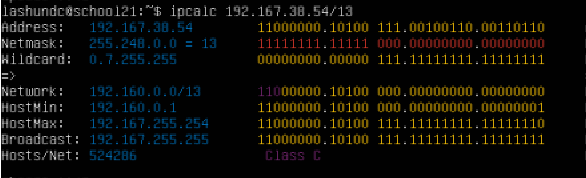
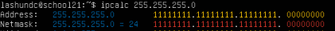
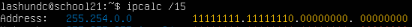
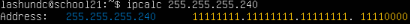
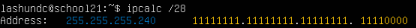

## Part 1. Инструмент **ipcalc**

#### 1.1. Сети и маски

##### Определи и запиши в отчёт:

##### 1) Адрес сети *192.167.38.54/13*

##### 2) Перевод маски *255.255.255.0* в префиксную и двоичную запись

##### Префиксная каждый 255 = 11111111 (8 бит), 0 = 00000000 (0 бит) = 8+8+8+0 = 24

##### Двоичная 11111111.11111111.11111111.00000000

##### */15* в обычную и двоичную

##### Обыная

##### Двоичная

##### *11111111.11111111.11111111.11110000* в обычную

##### Для того чтоб в ipcalc рачитать двоичную маску, нужно ее перевести вручную. Посчитать каждый октет. Если все биты в октете = 1 в целом вес октета будет 255. В последнем октете идет *11110000*. Расчитаем именно это так: 1(128) + 1(64) + 1(32) + 1 (16) + 0 + 0 + 0 + 0 = 240.

##### Префиксную

##### Для того, чтоб расчитать префикс мы мы складываем каждый бит в октете, так и выходит, что 8+8+8+4 = 28

##### 3) Минимальный и максимальный хост в сети *12.167.38.4* при масках: */8*, *11111111.11111111.00000000.00000000*, *255.255.254.0* и */4*