## Part 1. Инструмент **ipcalc**

#### 1.1. Сети и маски

##### Определи и запиши в отчёт:

##### 1) Адрес сети *192.167.38.54/13*

##### 2) Перевод маски *255.255.255.0* в префиксную и двоичную запись

##### Префиксная каждый 255 = 11111111 (8 бит), 0 = 00000000 (0 бит) = 8+8+8+0 = 24

##### Двоичная 11111111.11111111.11111111.00000000

##### */15* в обычную и двоичную

##### Обыная

##### Двоичная

##### *11111111.11111111.11111111.11110000* в обычную

##### Для того чтоб в ipcalc рачитать двоичную маску, нужно ее перевести вручную. Посчитать каждый октет. Если все биты в октете = 1 в целом вес октета будет 255. В последнем октете идет *11110000*. Расчитаем именно это так: 1(128) + 1(64) + 1(32) + 1 (16) + 0 + 0 + 0 + 0 = 240.

##### Префиксную

##### Для того, чтоб расчитать префиксную мы складываем каждый бит в октете, так и выходит, что 8+8+8+4 = 28

##### 3) Минимальный и максимальный хост в сети *12.167.38.4* при масках: */8*, *11111111.11111111.00000000.00000000*, *255.255.254.0* и */4*

##### Маска */8*:

##### Hostmin - 12.0.0.1
##### Hostmax - 12.255.255.254

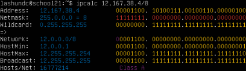

##### Маска *11111111.11111111.00000000.00000000*:

##### Hostmin - 12.167.0.1
##### Hostmax - 12.167.255.254

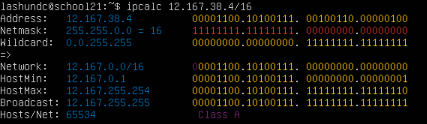

##### Маска *255.255.254.0*:

##### Hostmin - 12.167.38.1
##### Hostmax - 12.167.39.254

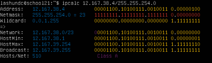

##### Маска */4*:

##### Hostmin - 0.0.0.1
##### Hostmax - 15.255.255.254

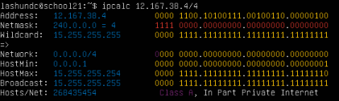

#### 1.2. localhost
##### Определи и запиши в отчёт, можно ли обратиться к приложению, работающему на localhost, со следующими IP: *194.34.23.100*, *127.0.0.2*, *127.1.0.1*, *128.0.0.1*

##### Адреса к которым можно обратиться: *127.0.0.2*, *127.1.0.1* (есть пометка Loopback)

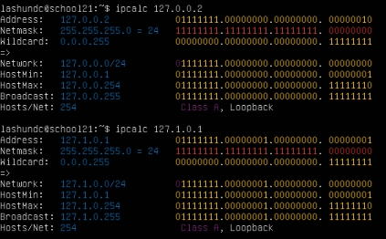

##### Адреса к которым нельзя обратиться: *194.34.23.100*, *128.0.0.1* (нет пометки Loopback)

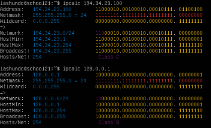

#### 1.3. Диапазоны и сегменты сетей
##### Определи и запиши в отчёт:
##### 1) Какие из перечисленных IP можно использовать в качестве публичного, а какие только в качестве частных: *10.0.0.45*, *134.43.0.2*, *192.168.4.2*, *172.20.250.4*, *172.0.2.1*, *192.172.0.1*, *172.68.0.2*, *172.16.255.255*, *10.10.10.10*, *192.169.168.1*

##### Нельзя использовать в качестве публичных: *10.0.0.45*, *192.168.4.2*, *172.20.250.4*, *172.16.255.255*, *10.10.10.10*

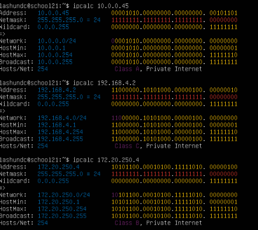

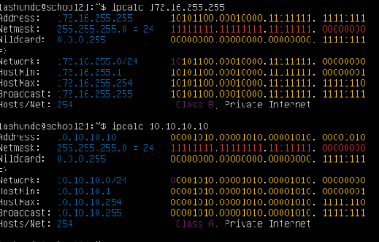

##### Можно использовать в качестве публичных: *134.43.0.2*, *172.0.2.1*, *192.172.0.1*, *172.68.0.2*, *192.169.168.1*

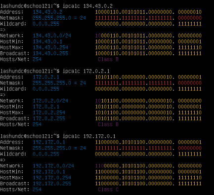

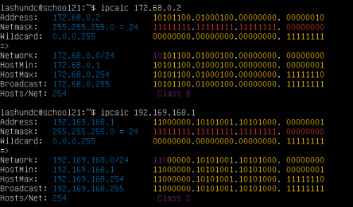

##### *Пояснение*: В IP-адресах которые нельзя использовать в качестве публичных в утилите есть надпись "Private Internet". Соответсвенно если нет такой надписи, то такие IP-адреса можно использовать в качестве публичных.

##### 2) Какие из перечисленных IP-адресов шлюза возможны у сети *10.10.0.0/18*: *10.0.0.1*, *10.10.0.2*, *10.10.10.10*, *10.10.100.1*, *10.10.1.255*

##### Пояснение для утилиты ipcalc. Для того чтоб узнать возможные шлюзы мы к каждому ip-адресу применяем маску */18*, если Network совпадает у обеих адресов - значит он может быть шлюзом.

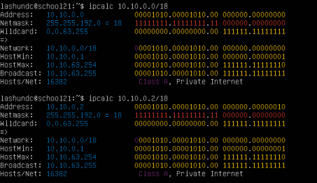

##### Возожные шлюзы: *10.10.0.2*, *10.10.10.10*, *10.10.1.255*

## Part 2. Статическая маршрутизация между двумя машинами

##### Подними две виртуальные машины (далее -- ws1 и ws2).

##### С помощью команды `ip a` посмотри существующие сетевые интерфейсы.

##### WS1:

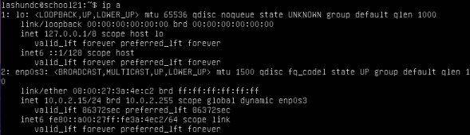

##### WS2:

