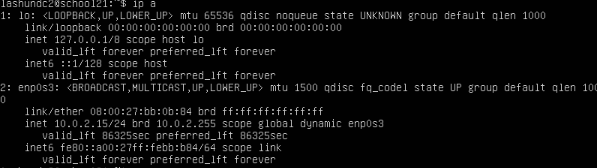
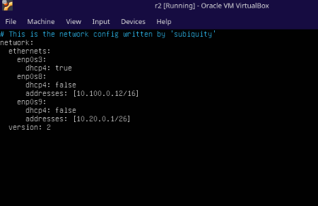
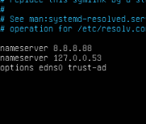
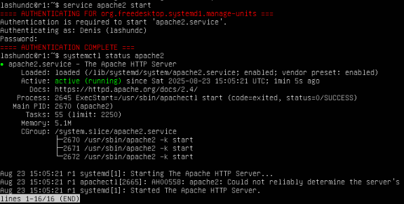

## Part 1. Инструмент **ipcalc**

#### 1.1. Сети и маски

##### Определи и запиши в отчёт:

##### 1) Адрес сети *192.167.38.54/13*


##### 2) Перевод маски *255.255.255.0* в префиксную и двоичную запись

##### Префиксная каждый 255 = 11111111 (8 бит), 0 = 00000000 (0 бит) = 8+8+8+0 = 24


##### Двоичная 11111111.11111111.11111111.00000000


##### */15* в обычную и двоичную

##### Обыная


##### Двоичная


##### *11111111.11111111.11111111.11110000* в обычную

##### Для того чтоб в ipcalc рачитать двоичную маску, нужно ее перевести вручную. Посчитать каждый октет. Если все биты в октете = 1 в целом вес октета будет 255. В последнем октете идет *11110000*. Расчитаем именно это так: 1(128) + 1(64) + 1(32) + 1 (16) + 0 + 0 + 0 + 0 = 240.


##### Префиксную

##### Для того, чтоб расчитать префиксную мы складываем каждый бит в октете, так и выходит, что 8+8+8+4 = 28


##### 3) Минимальный и максимальный хост в сети *12.167.38.4* при масках: */8*, *11111111.11111111.00000000.00000000*, *255.255.254.0* и */4*

##### Маска */8*:

##### Hostmin - 12.0.0.1
##### Hostmax - 12.255.255.254


##### Маска *11111111.11111111.00000000.00000000*:

##### Hostmin - 12.167.0.1
##### Hostmax - 12.167.255.254


##### Маска *255.255.254.0*:

##### Hostmin - 12.167.38.1
##### Hostmax - 12.167.39.254


##### Маска */4*:

##### Hostmin - 0.0.0.1
##### Hostmax - 15.255.255.254


#### 1.2. localhost
##### Определи и запиши в отчёт, можно ли обратиться к приложению, работающему на localhost, со следующими IP: *194.34.23.100*, *127.0.0.2*, *127.1.0.1*, *128.0.0.1*

##### Адреса к которым можно обратиться: *127.0.0.2*, *127.1.0.1* (есть пометка Loopback)


##### Адреса к которым нельзя обратиться: *194.34.23.100*, *128.0.0.1* (нет пометки Loopback)


#### 1.3. Диапазоны и сегменты сетей
##### Определи и запиши в отчёт:
##### 1) Какие из перечисленных IP можно использовать в качестве публичного, а какие только в качестве частных: *10.0.0.45*, *134.43.0.2*, *192.168.4.2*, *172.20.250.4*, *172.0.2.1*, *192.172.0.1*, *172.68.0.2*, *172.16.255.255*, *10.10.10.10*, *192.169.168.1*

##### Нельзя использовать в качестве публичных: *10.0.0.45*, *192.168.4.2*, *172.20.250.4*, *172.16.255.255*, *10.10.10.10*


##### Можно использовать в качестве публичных: *134.43.0.2*, *172.0.2.1*, *192.172.0.1*, *172.68.0.2*, *192.169.168.1*


##### *Пояснение*: В IP-адресах которые нельзя использовать в качестве публичных в утилите есть надпись "Private Internet". Соответсвенно если нет такой надписи, то такие IP-адреса можно использовать в качестве публичных.

##### 2) Какие из перечисленных IP-адресов шлюза возможны у сети *10.10.0.0/18*: *10.0.0.1*, *10.10.0.2*, *10.10.10.10*, *10.10.100.1*, *10.10.1.255*

##### Пояснение для утилиты ipcalc. Для того чтоб узнать возможные шлюзы мы к каждому ip-адресу применяем маску */18*, если Network совпадает у обеих адресов - значит он может быть шлюзом.


##### Возожные шлюзы: *10.10.0.2*, *10.10.10.10*, *10.10.1.255*

## Part 2. Статическая маршрутизация между двумя машинами

##### Подними две виртуальные машины (далее -- ws1 и ws2).

##### С помощью команды `ip a` посмотри существующие сетевые интерфейсы.

##### WS1:


##### WS2:



##### Опиши сетевой интерфейс, соответствующий внутренней сети, на обеих машинах и задай следующие адреса и маски: ws1 — *192.168.100.10*, маска */16*, ws2 — *172.24.116.8*, маска */12*.

##### WS1:


##### WS2:


##### Выполни команду `netplan apply` для перезапуска сервиса сети.

##### WS1:


##### WS2:


#### 2.1. Добавление статического маршрута вручную
##### Добавь статический маршрут от одной машины до другой и обратно при помощи команды вида `ip r add`.
##### Пропингуй соединение между машинами.

##### WS1:


##### WS2:


#### 2.2. Добавление статического маршрута с сохранением
##### Перезапусти машины.
##### Добавь статический маршрут от одной машины до другой с помощью файла */etc/netplan/00-installer-config.yaml*.

##### WS1:


##### WS2:


## Part 3. Утилита **iperf3**

#### 3.1. Скорость соединения
##### Переведи и запиши в отчёт: 8 Mbps в MB/s, 100 MB/s в Kbps, 1 Gbps в Mbps.

##### 8 Mbps = 1 MB/s
##### 100 MB/s = 800 000 Kbps
##### 1 Gbps = 1000 Mbps

#### 3.2. Утилита **iperf3**
##### Измерь скорость соединения между ws1 и ws2.

##### WS1:


##### WS2:


## Part 4. Сетевой экран

#### 4.1. Утилита **iptables**
##### Создай файл */etc/firewall.sh*, имитирующий файрвол, на ws1 и ws2:
```shell
#!/bin/sh

# Удаление всех правил в таблице «filter» (по умолчанию).
iptables -F
iptables -X
```
##### Нужно добавить в файл подряд следующие правила:
##### 1) На ws1 примени стратегию, когда в начале пишется запрещающее правило, а в конце пишется разрешающее правило (это касается пунктов 4 и 5).
##### 2) На ws2 примени стратегию, когда в начале пишется разрешающее правило, а в конце пишется запрещающее правило (это касается пунктов 4 и 5).
##### 3) Открой на машинах доступ для порта 22 (ssh) и порта 80 (http).
##### 4) Запрети *echo reply* (машина не должна «пинговаться», т. е. должна быть блокировка на OUTPUT).
##### 5) Разреши *echo reply* (машина должна «пинговаться»).

##### WS1:


##### WS2:


##### Запусти файлы на обеих машинах командами `chmod +x /etc/firewall.sh` и `/etc/firewall.sh`.

##### WS1:


##### WS2:


##### *Разница между стратегиями, применёнными в первом и втором файлах, заключается в следующем: в утилите iptables правила выполняются сверху вниз. На первой машине первым указано запрещающее правило на выход, поэтому она не сможет пропинговать другую машину. У второй машины, наоброт - первым указано разрешающее правило, значит она сможет пропинговать другую машину.*

#### 4.2. Утилита **nmap**
##### Командой **ping** найди машину, которая не «пингуется», после чего утилитой **nmap** покажи, что хост машины запущен.

##### WS1:


##### WS2:


##### Сохрани дампы образов виртуальных машин

##### Для сохранения образов машины в настройках машины выбираем snapshots.


##### Затем take и добавляем snapshots.


##### ГОТОВО!! Дампы образов сохранены!

## Part 5. Статическая маршрутизация сети

##### Подними пять виртуальных машин (3 рабочие станции (ws11, ws21, ws22) и 2 роутера (r1, r2)).

#### 5.1. Настройка адресов машин
##### Настрой конфигурации машин в *etc/netplan/00-installer-config.yaml* согласно сети на рисунке.

##### R1:


##### R2:



##### WS11:


##### WS21:


##### WS22:


##### Перезапусти сервис сети. Если ошибок нет, командой `ip -4 a` проверь, что адрес машины задан верно. Также пропингуй ws22 с ws21. Аналогично пропингуй r1 с ws11.

##### R1:


##### R2:


##### WS11:


##### WS21:


##### WS22:


##### Также пропингуй ws22 с ws21. Аналогично пропингуй r1 с ws11.

##### ws22 с ws21:


##### r1 c ws11:


#### 5.2. Включение переадресации IP-адресов
##### Для включения переадресации IP выполни команду на роутерах:

##### R1:


##### R2:


##### Открой файл */etc/sysctl.conf* и добавь в него следующую строку:
`net.ipv4.ip_forward = 1`

##### R1:


##### R2:


#### 5.3. Установка маршрута по умолчани

##### Настрой маршрут по умолчанию (шлюз) для рабочих станций. Для этого добавь `default` перед IP-роутера в файле конфигураций.

##### WS11:


##### WS21:


##### WS22:


##### Вызови `ip r` и покажи, что добавился маршрут в таблицу маршрутизации.

##### WS11:


##### WS21:


##### WS22:


##### Пропингуй с ws11 роутер r2 и покажи на r2, что пинг доходит. Для этого используй команду:
`tcpdump -tn -i eth0`

##### На r2 сначла прописываем tcpdump -tn -i enp0s8:


##### Затем на ws11 пингуем и и тем самым видим что пинг проходит:


#### 5.4. Добавление статических маршрутов
##### Добавь в роутеры r1 и r2 статические маршруты в файле конфигураций. Пример для r1 маршрута в сетку 10.20.0.0/26:
```shell
# Добавь в конец описания сетевого интерфейса eth1:
- to: 10.20.0.0
  via: 10.100.0.12
```

##### r1:


##### r2:


##### Вызови `ip r` и покажи таблицы с маршрутами на обоих роутерах.

##### r1:


##### r2:


##### Запусти команды на ws11:


##### *Для адреса 10.10.0.0/18 был выбран маршрут, другой от 0.0.0.0/0. Машина ws11 соединена с сетью 10.10.0.0/18 по своему IP-адресу 10.10.0.2, для других адресов используется маршрут по умолчанию, который указан в файле 10.10.0.1.*

#### 5.5. Построение списка маршрутизаторов

##### Запусти на r1 команду дампа:
`tcpdump -tnv -i eth0`
##### При помощи утилиты **traceroute** построй список маршрутизаторов на пути от ws11 до ws21.

##### r1:


##### ws11:


##### *Каждый пакет проходит на своем пути определенное количество узлов, пока достигнет своей цели. Причем, каждый пакет имеет свое время жизни. Это количество узлов, которые может пройти пакет перед тем, как он будет уничтожен. Этот параметр записывается в заголовке TTL, каждый маршрутизатор, через который будет проходить пакет уменьшает его на единицу. При TTL=0 пакет уничтожается, а отправителю отсылается сообщение Time Exceeded.*

##### *Команда traceroute linux использует UDP пакеты. Она отправляет пакет с TTL=1 и смотрит адрес ответившего узла, дальше TTL=2, TTL=3 и так пока не достигнет цели. Каждый раз отправляется по три пакета и для каждого из них измеряется время прохождения. Пакет отправляется на случайный порт, который, скорее всего, не занят. Когда утилита traceroute получает сообщение от целевого узла о том, что порт недоступен трассировка считается завершенной.*

#### 5.6. Использование протокола **ICMP** при маршрутизации
##### Запусти на r1 перехват сетевого трафика, проходящего через eth0 с помощью команды:
`tcpdump -n -i eth0 icmp`
##### Пропингуй с ws11 несуществующий IP (например, *10.30.0.111*) с помощью команды:
`ping -c 1 10.30.0.111`

##### r1:


##### ws11:


##### ДАМПЫ СОХРАНЕНЫ!!!!

## Part 6. Динамическая настройка IP с помощью **DHCP**

##### Для r2 настрой в файле */etc/dhcp/dhcpd.conf* конфигурацию службы **DHCP**:
##### 1) Укажи адрес маршрутизатора по умолчанию, DNS-сервер и адрес внутренней сети. Пример файла для r2:
```shell
subnet 10.100.0.0 netmask 255.255.0.0 {}

subnet 10.20.0.0 netmask 255.255.255.192
{
    range 10.20.0.2 10.20.0.50;
    option routers 10.20.0.1;
    option domain-name-servers 10.20.0.1;
}
```


##### 2) В файле *resolv.conf* пропиши `nameserver 8.8.8.8`.



##### Перезагрузи службу **DHCP** командой `systemctl restart isc-dhcp-server`. Машину ws21 перезагрузи при помощи `reboot` и через `ip a` покажи, что она получила адрес. Также пропингуй ws22 с ws21.

##### Перезапуск службы DHCP:


##### Машину ws21 перезагрузи при помощи `reboot` и через `ip a` покажи, что она получила адрес:


##### Пропингуй ws22 с ws21:


##### Укажи MAC-адрес у ws11, для этого в *etc/netplan/00-installer-config.yaml* надо добавить строки: `macaddress: 10:10:10:10:10:BA`, `dhcp4: true`.


##### Для r1 настрой аналогично r2, но сделай выдачу адресов с жесткой привязкой к MAC-адресу (ws11). Проведи аналогичные тесты.


##### Проведи аналогичные тесты.


##### Запроси с ws21 обновление IP-адреса.

##### Запросим с ws21 обновление ip адреса с помощью команды sudo dhclient -v, затем ip a.


##### Выполним команду для удаления старого IP адреса sudo dhclient -r


##### Чтобы обновить или освободить IP-адрес для конкретного интерфейса, необходимо ввести: dhclient -r enp0s8, dhclient enp0s8


*В части 6 были использованы следующие опции DHCP протокола:

option routers ip-address [, ip-address...]; - адреса шлюзов для клиентской сети.Маршрутизаторы должны быть перечислены в порядке предпочтительности.
option domain-name-servers ip-address [, ip-address...]; - Список DNS серверов доступных клиенту. Сервера должны быть перечислены в порядке предпочтительности.*

##### ДАМПЫ СОХРАНЕНЫ !!

## Part 7. **NAT**

##### В файле */etc/apache2/ports.conf* на ws22 и r1 измени строку `Listen 80` на `Listen 0.0.0.0:80`, то есть сделай сервер Apache2 общедоступным.

##### ws22:


##### r1:


##### Запусти веб-сервер Apache командой `service apache2 start` на ws22 и r1.




##### Добавь в фаервол, созданный по аналогии с фаерволом из Части 4, на r2 следующие правила:
##### 1) Удаление правил в таблице filter — `iptables -F`;
##### 2) Удаление правил в таблице «NAT» — `iptables -F -t nat`;
##### 3) Отбрасывать все маршрутизируемые пакеты — `iptables --policy FORWARD DROP`.
##### Запусти файл также, как в Части 4.
##### Проверь соединение между ws22 и r1 командой `ping`.


##### Добавь в файл ещё одно правило:
##### 4) Разрешить маршрутизацию всех пакетов протокола **ICMP**.
##### Запусти файл также, как в Части 4.
##### Проверь соединение между ws22 и r1 командой `ping`.


##### Добавь в файл ещё два правила:
##### 5) Включи **SNAT**, а именно маскирование всех локальных IPиз локальной сети, находящейся за r2 (по обозначениям из Части 5 — сеть 10.20.0.0).
##### 6) Включи **DNAT** на 8080 порт машины r2 и добавить к веб-серверу Apache, запущенному на ws22, доступ извне сети.


##### Запусти файл также, как в Части 4.


##### Проверь соединение по TCP для **SNAT**: для этого с ws22 подключиться к серверу Apache на r1 командой:
`telnet [адрес] [порт]`


##### Проверь соединение по TCP для **DNAT**: для этого с r1 подключиться к серверу Apache на ws22 командой `telnet` (обращаться по адресу r2 и порту 8080).


##### ДАМПЫ СОХРАНИЛ!
